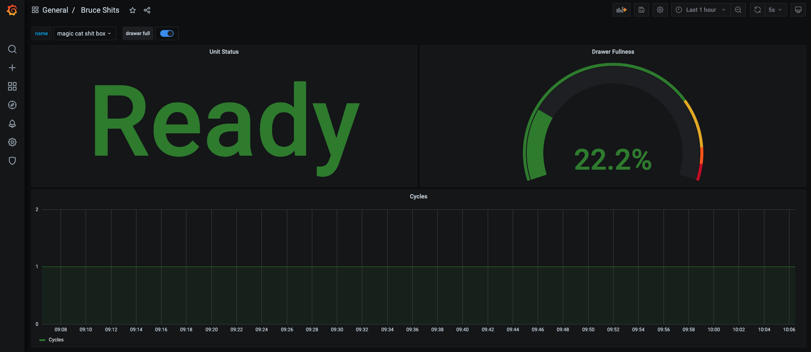

# Litter Exporter  [![Go Report Badge]][Go Report] [![GoDocBadge]][GoDocLink]

Litter Exporter is a Prometheus exporter for the [Litter Robot](https://www.litter-robot.com/).

**This exporter uses an experimental API.** The upstream Litter Robot API is not publicly documented and may cause breaking
changes with no notice. Breaking changes will be handled as soon as possible.



## Example
An example Docker Compose configuration is contained in the [doc/examples](doc/examples) folder.

To run this example, substitute values for `email` and `password` and run `docker-compose up`.

## Metrics
Metrics are available at the default and metrics endpoints (`/` and `/metrics` respectively).

| Name                          | Type    |
|-------------------------------|---------|
| litterrobot_capacity          | Gauge   |
| litterrobot_cycles            | Counter |
| litterrobot_drawer_full       | Gauge   |
| litterrobot_nightlight        | Gauge   |
| litterrobot_sleepmode         | Gauge   |
| litterrobot_unit_status       | Gauge   |
| litterrobot_wait_time_minutes | Gauge   |
| litterrobot_panel_locked      | Gauge   |
| litterrobot_dfi_cycle_count    | Gauge   |
| litterrobot_cycles_until_full | Gauge   |
| litterrobot_cycles_after_full | Gauge   |

## Labels
| Name   | Value                                                                |
|--------|----------------------------------------------------------------------|
| name   | The name of the Litter Robot provided by the user during onboarding. |
| id     | The ID of the Litter Robot unit according to the API.                |
| serial | The serial number of the Litter Robot unit.                          |

## Usage
The Litter Exporter can be installed on a target machine or executed in a Docker container. The configuration options
are the same for both.

#### Docker
```console
$ docker run --rm -p 9080:9080 tlkamp/litter-exporter:latest \
    --email "your-email@example.com" \
    --password "your-password"
```

#### CLI
```console
$ ./litter-exporter --help
Usage of ./litter-exporter:
      --address string     the server address (default "0.0.0.0:9080")
      --email string       litter robot account email address
  -h, --help               print help and exit
      --log-level string   the log level (default "info")
      --password string    litter robot account password
```

## Configuration
The litter robot _requires_ only two pieces of information for configuration: the account email address and password.

The other fields are optional and provided as a convenience in case the upstream Litter Robot API changes.

### Environment Variables
All CLI options can be configured as environment variables. Environment variables are all-caps (uppercase) and
prefixed with `LR_`.

If CLI arguments contain hyphens (`-`), use an underscore as a replacement in environment variable names.

#### Example:
```console
$ export LR_EMAIL="your-email-address@example.com"
$ export LR_PASSWORD="yourPassword"
$ export LR_LOG_LEVEL=debug
$ ./litter-exporter
```

## Unit Status
The unit status is represented by a non-negative integer.

| **String** | **Int** | **Description**                      |
|------------|---------|--------------------------------------|
| RDY        | 0       | Ready                                |
| CCP        | 1       | Clean Cycle in Progress              |
| CCC        | 2       | Clean Cycle Complete                 |!
| CSF        | 3       | Cat Sensor Fault                     |
| DF1        | 4       | Drawer full - will still cycle       |
| DF2        | 5       | Drawer full - will still cycle       |
| CST        | 6       | Cat Sensor Timing                    |
| CSI        | 7       | Cat Sensor Interrupt                 |
| BR         | 8       | Bonnet Removed                       |
| P          | 9       | Paused                               |
| OFF        | 10      | Off                                  |
| SDF        | 11      | Drawer full - will not cycle         |
| DFS        | 12      | Drawer full - will not cycle         |

[Go Report Badge]: https://goreportcard.com/badge/github.com/tlkamp/litter-exporter
[Go Report]: https://goreportcard.com/report/github.com/tlkamp/litter-exporter
[GoDocBadge]: https://godoc.org/github.com/tlkamp/litter-exporter?status.svg
[GoDocLink]: https://godoc.org/github.com/tlkamp/litter-exporter
